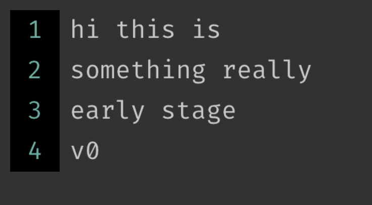

# rippope

A text editor implementation using piece tables for efficient editing, built on Clay and Raylib.



## Project Structure

```
rippope/
├── include/                    # Header files
│   ├── clay_utils/             # Clay library headers
│   │   ├── clay.h
│   │   └── clay_renderer_raylib.h
│   └── piece_table.h           # Piece table implementation header
├── src/                        # Source files
│   ├── clay_utils/             # Clay library source
│   │   └── clay_renderer_raylib.c
│   ├── tests/                  # Test sources
│   │   ├── CMakeLists.txt      # Test-specific CMake config
│   │   ├── main.c              # Test program
│   │   └── test.txt            # Test data
│   ├── main.c                  # Main application source
│   └── piece_table.c           # Piece table implementation
├── resources/                  # Application resources
│   └── fonts/                  # Font files
├── CMakeLists.txt              # Main CMake configuration
├── build.sh                    # Build helper script
└── CMAKE.md                    # Detailed build system documentation
```

## Features

- Piece table implementation for efficient text manipulation
- Clay-based UI rendering using Raylib for cross-platform support
- Cursor movement, text insertion, and deletion

## Building

### Prerequisites

- CMake 3.14 or higher
- C compiler with C11 support
- Git (for fetching dependencies)

### Build Instructions

```bash
# Clone the repository
git clone https://github.com/yourusername/rippope.git
cd rippope

# Create a build directory
mkdir build
cd build

# Configure and build
cmake ..
cmake --build .
```

### Running

```bash
# From the build directory
./clay_test
```

### Running Tests

```bash
# From the build directory
./piece_table_test test.txt
```

## Dependencies

- [Raylib](https://github.com/raysan5/raylib) - A simple and easy-to-use library for game development
- Clay - A UI library included in the repository

## License

This project is licensed under the MIT License - see the LICENSE file for details.
- Clay-based UI rendering using Raylib for cross-platform support
- Cursor movement, text insertion, and deletion

## Building

### Prerequisites

- CMake 3.14 or higher
- C compiler with C11 support
- Git (for fetching dependencies)

### Build Instructions

```bash
# Clone the repository
git clone https://github.com/yourusername/rippope.git
cd rippope

# Create a build directory
mkdir build
cd build

# Configure and build
cmake ..
cmake --build .
```

### Running

```bash
# From the build directory
./clay_test
```

### Running Tests

```bash
# From the build directory
./piece_table_test tests/test.txt
```

## Dependencies

- [Raylib](https://github.com/raysan5/raylib) - A simple and easy-to-use library for game development
- [Clay](https://github.com/nicbarker/clay) - A UI library included in the repository

## License

This project is licensed under the MIT License - see the LICENSE file for details.
